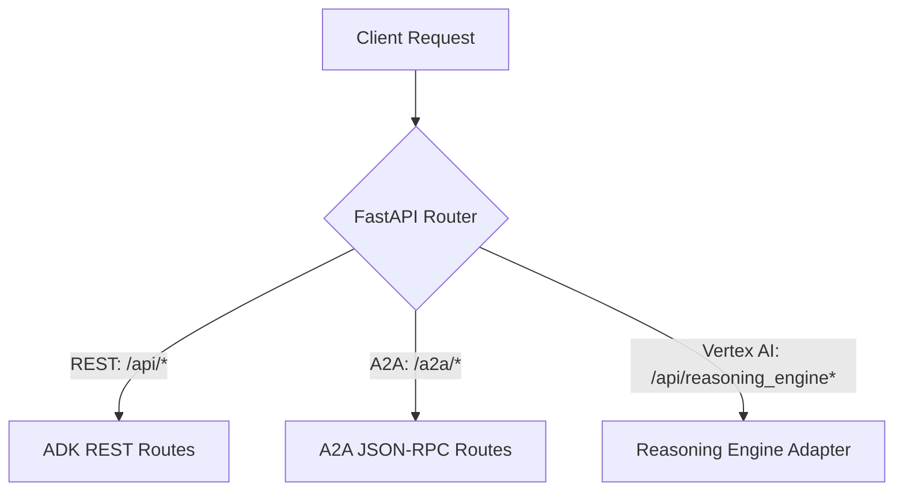

# Chapter 11: Unified HTTP Serving Architecture

To support diverse serving protocols under a single runtime environment, modern Hubscape agents utilize a unified FastAPI-based HTTP server. This architecture exposes REST, A2A, and Vertex AI Reasoning Engine interfaces simultaneously.

---

## 1. Main Entry Point (`fast_api_app.py`)

The serving lifecycle is driven by `[app/core/fast_api_app.py](file:///Users/rajvekeria/Documents/GitHub/hubscape-agent-template/app/core/fast_api_app.py)`. It wraps the standard `get_fast_api_app` from the ADK library and configures custom lifespan events, routes, and middleware.



### Server Lifespan Async Context Manager:
When the server boots, the `lifespan` context manager instantiates the central execution runner. This runner binds the agent instance to the process-wide shared services:
```python
@contextlib.asynccontextmanager
async def lifespan(app: FastAPI) -> AsyncIterator[None]:
    from app.agent import app as adk_app
    from app.agent import root_agent

    runner = Runner(
        app=adk_app,
        session_service=services.get_session_service(),
        artifact_service=services.get_artifact_service(),
        auto_create_session=True,
    )
    app.state.runner = runner
    app.state.agent_app_name = adk_app.name
    
    # Mount inbound A2A routes
    await attach_a2a_routes(
        app,
        agent=root_agent,
        runner=runner,
        task_store=InMemoryTaskStore(),
        rpc_path=f"/a2a/{adk_app.name}",
    )
    yield
```

---

## 2. Shared Services Architecture

To ensure data and files created on one endpoint (e.g. ADK REST) are accessible across other endpoints (e.g. A2A JSON-RPC or Vertex Reasoning Engine queries), services are registered process-wide under the custom `shared://` URI scheme in `[app/app_utils/services.py](file:///Users/rajvekeria/Documents/GitHub/hubscape-agent-template/app/app_utils/services.py)`.

* **`shared://session`**: Resolves to `VertexAiSessionService` when deployed on Google Cloud Platform, and falls back to `InMemorySessionService` locally (monkeypatching database updates to `local_db.json`).
* **`shared://artifact`**: Resolves to `GcsArtifactService` on GCP when `LOGS_BUCKET_NAME` is configured, and falls back to `InMemoryArtifactService` locally.

---

## 3. Vertex AI Reasoning Engine Adapter

Gemini Enterprise and the Vertex AI Console Playground execute queries by calling the Reasoning Engine `/api/reasoning_engine` (synchronous) and `/api/stream_reasoning_engine` (streaming) endpoints. 

These routes are dynamically mounted by the `attach_reasoning_engine_routes(app)` helper defined in `[app/app_utils/reasoning_engine_adapter.py](file:///Users/rajvekeria/Documents/GitHub/hubscape-agent-template/app/app_utils/reasoning_engine_adapter.py)`. 

### Protocol Translation:
The adapter intercepts the reasoning engine payload (`{ "class_method": "...", "input": {...} }`), translates the class method into the matching `AdkApp` operation, executes the action using the shared runner, and formats the output back into the expected JSON structure:
* **Sync endpoint:** Returns `{ "output": ... }`.
* **Stream endpoint:** Streams line-delimited JSON events.

---

## 4. Inbound Agent-to-Agent (A2A) Routing

Inbound A2A routing is mounted by `attach_a2a_routes()` from `[app/app_utils/a2a.py](file:///Users/rajvekeria/Documents/GitHub/hubscape-agent-template/app/app_utils/a2a.py)`. It exposes three main routes under `/a2a/{agent_name}`:
1. **`/.well-known/agent-card.json`**: Exposes the capabilities of your agent to the platform.
2. **`/agent-card.json`**: An extended card detailing schemas and functions.
3. **`/` (Root rpc path)**: A JSON-RPC endpoint that accepts task execution and streaming requests delegated by other agents.

---

## 5. Deployment Containerization (`Dockerfile`)

The containerized FastAPI application is built using the root `[Dockerfile](file:///Users/rajvekeria/Documents/GitHub/hubscape-agent-template/Dockerfile)`. When deploying to container-based runtimes:
- The container installs dependencies via `pyproject.toml`.
- Boots the server using Uvicorn:
  ```bash
  uv run uvicorn app.core.fast_api_app:app --host 0.0.0.0 --port 8000
  ```

---

[Next Chapter: Agent Evaluation & Diagnostics Suite](CHAPTER_12_EVALUATION_AND_DIAGNOSTICS.md) | [Previous Chapter: GEAP Platform Manual](CHAPTER_10_GEAP_PLATFORM_MANUAL.md)
