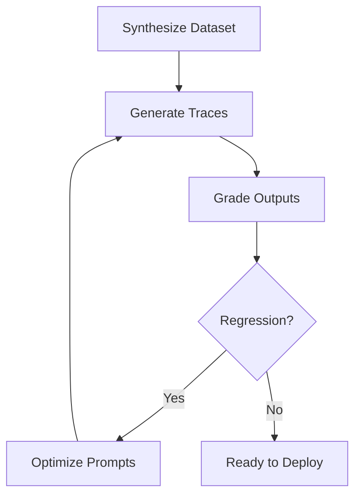

# Chapter 12: Agent Evaluation & Diagnostics Suite

Building resilient custom agents requires a continuous feedback loop of evaluation, regression testing, and robust diagnostic reporting.

---

## 1. Local Testing & Playground

Before running formal evaluations, use the local CLI tools to verify your tool and agent loop behaviors.

### Interactive Local Playground:
Run the interactive CLI playground to talk directly to your agent:
```bash
agents-cli playground
```
This boots your local agent using your Application Default Credentials (ADC) and provides an interactive terminal to test tool calls, instruction following, and response streaming.

### Automated Tests:
Run the python test suite to catch syntax and logic regressions:
```bash
uv run pytest tests/unit tests/integration
```

---

## 2. The Evaluation Loop (`agents-cli eval`)

The evaluation pipeline allows you to systematically measure prompt changes, tool effectiveness, and accuracy across iterations.



### Evaluation Commands:
1. **`agents-cli eval dataset synthesize`**: Generates synthetic, multi-turn conversation datasets specific to your agent's domain to run evaluations against.
2. **`agents-cli eval generate`**: Runs your agent logic against the evaluation dataset and outputs execution trace files.
3. **`agents-cli eval grade`**: Runs LLM-as-judge evaluation against the generated traces using defined metrics (e.g. tool execution accuracy, helpfulness, instruction compliance) and prints scoring summaries.
4. **`agents-cli eval compare <grade-file-1> <grade-file-2>`**: Diff two grading results to check for regressions when you modify prompts or tools.
5. **`agents-cli eval optimize`**: Automatically tunes and optimizes prompt instructions in `SKILL.md` using the evaluation results.

---

## 3. The `debug_env` Diagnostic Hook

In production cloud environments, resolving connection, permission, or loading failures is difficult without terminal access. To resolve this, all GEAP-compatible agents **MUST** implement a `"debug_env"` diagnostic hook in their query execution loop.

### How it Works:
1. If the agent receives the exact question `"debug_env"`, it must bypass standard tool calling and instructions.
2. It immediately compiles and returns a markdown-formatted diagnostic report.

### Required Diagnostic Information:
* **GCP Env**: Project ID, region, and available service account email credentials.
* **Paths**: Current working directory and lists of available files under `app/` and the root path.
* **Libraries**: Deployed versions of critical packages (e.g., `google-adk`, `google-cloud-aiplatform`).
* **Tool Imports**: Any Python execution warnings or stack traces captured by `[load_local_tools.py](file:///Users/rajvekeria/Documents/GitHub/hubscape-agent-template/app/core/load_local_tools.py)` during startup.

---

[Previous Chapter: Unified HTTP Serving Architecture](CHAPTER_11_UNIFIED_HTTP_SERVING_ARCHITECTURE.md)
