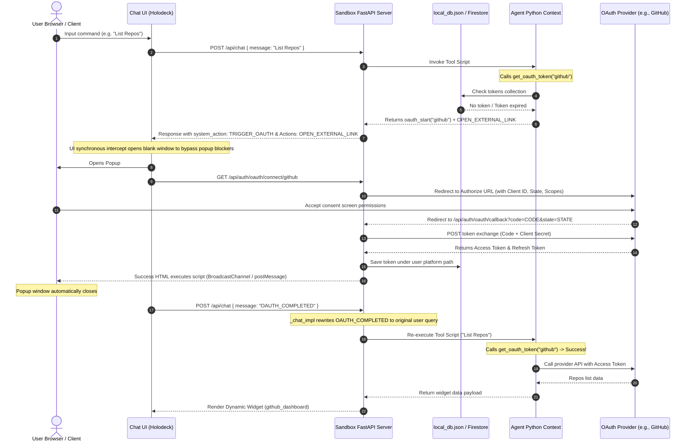

# Chapter 7: OAuth Integration & Hubscape ADK API Reference

This chapter details how custom agents integrate third-party OAuth2 authentication flows, retrieve integration credentials safely, and leverage the complete `RemoteContext` database and tool serving APIs defined in `hubscape_adk.py`.

---

## 1. End-to-End OAuth Integration Flow

Hubscape implements a seamless, channel-agnostic OAuth flow that operates across Web/Chat, SMS, and Voice. 

### Flow Diagram



### The OAuth Lifecycle Breakdown

#### 1. Checking Connection (Agent Side)
The agent checks for an active credential using `await context.get_oauth_token(provider)`.
* If the token does not exist, or the provider API returns a `401 Unauthorized`, the agent wipes any stale record using `context.delete()` and initiates redirection:
  ```python
  token = context.raw_context.get("capability_token") or "mock_jwt_token"
  connect_url = f"/api/auth/oauth/connect/github?agent_id={context.agent_id}&token={token}"
  context.actions.append({
      "type": "OPEN_EXTERNAL_LINK",
      "payload": {"url": connect_url}
  })
  context.show_widget("connect_github")
  return context.oauth_start("github")
  ```

#### 2. Synchronous UI Intercept
To bypass aggressive popup blockers (such as in Safari), the frontend intercepts the submission of the authorization action. It immediately calls `window.open("", "_blank")` synchronously. Once the async chat backend responds with the `OPEN_EXTERNAL_LINK` URL, the popup window's location is updated.

#### 3. Redirection & State Preservation
The backend `/api/auth/oauth/connect/{provider}` endpoint checks if Client Credentials exist:
* **Real Local Mode**: Generates a base64 encoded `state` object containing `user_id`, `agent_id`, `provider`, and `redirect_back`. It then redirects the browser to the provider's OAuth authorize page.
* **Mock Local Mode**: If no client credentials are set, redirects to `/api/sandbox/mock_auth` to simulate the user authorization flow offline.

#### 4. Callback Handling & Token Persistence
When the user approves access, the provider redirects back to `/api/auth/oauth/callback` with an authorization `code` and the preserved `state`.
* The server performs a backend POST to exchange the code for an access token and refresh token.
* The received credentials are saved via `context.save_agent_token()`:
  * **Sandbox Mode**: Written to `local_db.json` under `"tokens"` with a composite key `"{user_id}::{agent_id}::{provider}"`.
  * **Production Mode**: Stored securely in Cloud Firestore under:
    `platform_users/{user_id}/agent_data/{agent_id}/tokens/{provider}`

#### 5. Event Signaling & Automated Re-Run
The callback success HTML triggers script fallbacks to signal the main tab that authentication is complete:
1. `window.opener.postMessage("oauth_success", "*")`
2. `new BroadcastChannel("hubscape_oauth").postMessage("oauth_success")`
3. Writing to `localStorage.setItem("hubscape_oauth_success", ...)`

The main tab receives the signal, closes the popup, and submits the silent event message `"OAUTH_COMPLETED"` to the chat. The execution engine parses history, rewrites `"OAUTH_COMPLETED"` to the user's last query (e.g. "List Repos"), and re-runs the tool. The tool finds the active token in the database, fetches the data, and returns the successful widgets.

#### 6. Client Credentials & Scope Configuration
In local sandbox development mode, the OIDC and OAuth integration resolves credentials (Client ID, Client Secret) using one of the following methods:
* **Holodeck Settings Dashboard**: Configure the Client ID and Client Secret dynamically via the Holodeck Settings UI. This writes the credentials directly to `oauth_settings.json` under your global config path.
* **Environment Variables**: Configure local environment credentials inside the agent's root `.env` file using the format:
  ```env
  {PROVIDER_NAME}_CLIENT_ID=your_client_id
  {PROVIDER_NAME}_CLIENT_SECRET=your_client_secret
  ```
  *(Example: `MOPL_CLIENT_ID=demo-client`)*

Scopes requested during authorization are resolved from the `"default_scopes"` key in your custom provider definition, or dynamically via the `"scope"` parameter.

#### 7. Provider Name Alignment & Case Sensitivity
> [!IMPORTANT]
> The provider identifier (e.g., `mopl`, `github`) is strictly case-sensitive. It **must match exactly** across all of the following:
> 1. The provider key in the Holodeck Settings UI (e.g., register as `mopl`).
> 2. The environment variables prefix in `.env` (e.g., `MOPL_CLIENT_ID` - uppercase required for env prefix).
> 3. The token placeholder in the headers of `config.json` (e.g., `${OAUTH_TOKEN:mopl}`).
> 4. The parameter passed to Python context methods (e.g., `await context.get_oauth_token("mopl")`).

---

## 2. OAuth API Methods in `hubscape_adk.py`

To facilitate OAuth integration, the `RemoteContext` class exposes specialized methods for retrieving, storing, and initiating authorization challenges.

### `get_oauth_token(provider: str) -> Optional[str]`
Fetches the active OAuth access token from the user-scoped database.
* **Expiration and Auto-Refresh**: If the token has expired or is scheduled to expire in the next 60 seconds, and a `refresh_token` exists, this method automatically initiates an asynchronous POST request to the provider's token URL with `grant_type="refresh_token"`. It saves the new token to storage and returns the refreshed access token.
* **Return Value**: The active access token as a string, or `None` if not connected.

### `oauth_start(provider: str, redirect_back: Optional[str] = None) -> dict`
Constructs the standard authentication challenge payload to send back to the hosting platform.
* **System Action**: Appends a `TRIGGER_OAUTH` action directive to instruct the frontend client to intercept and begin the redirection flow.
* **Return Value**: A structured dictionary containing status `"error"`, error type `"AUTH_REQUIRED"`, and the payload containing `provider`, `agent_id`, and `redirect_back` URL.

### `get_agent_token(token_name: str) -> Optional[dict]`
Retrieves the raw token dictionary from the user's private `tokens` collection scope. Used internally by `get_oauth_token`.

### `save_agent_token(token_name: str, data: dict) -> dict`
Saves or updates integration credentials in the private `tokens` collection. Used to persist access and refresh tokens.

---

## 3. Custom OAuth Agent Tool Scripts

When implementing an OAuth-enabled agent, the core interaction loop relies on the following custom tool scripts:

### `start_github_oauth`
Initiates the OAuth connection challenge.
* Appends an `OPEN_EXTERNAL_LINK` action to the context directing to the backend's `/connect` endpoint.
* Invokes `context.oauth_start("github")` to signal the authentication challenge to the host.

### `check_connection`
Checks the integration state.
* Resolves the current token via `context.get_oauth_token("github")`.
* If empty, triggers the OAuth flow.
* If a token is found, sends a verification GET request to `https://api.github.com/user`. If a `401 Unauthorized` is returned, wipes the invalid token and triggers the login flow.

### `get_github_profile`
Fetches and displays user profile and repository details.
* Verifies connection status and token validity.
* Displays the profile layout using the `github_dashboard` Lego widget template: `context.show_widget("github_dashboard", data=widget_data)`.

---

[Next Chapter: Advanced Integrations](CHAPTER_8_ADVANCED_INTEGRATIONS.md) | [Previous Chapter: Lego Widgets](CHAPTER_6_LEGO_WIDGETS_AND_IFRAMES.md)

