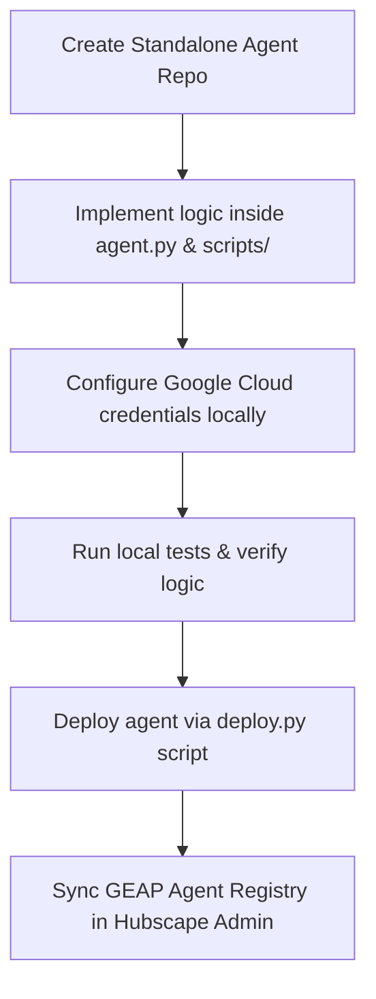

# Chapter 9: GEAP Developer Workflow

This chapter outlines the standard operating procedure (SOP) for developing, testing, and deploying specialized agents as Vertex AI Reasoning Engines (GEAP) for the Hubscape platform.

---

## 1. Workflow Overview



---

## 2. Step-by-Step Developer Journey

### Step 1: Initialize the Agent Repository
GEAP agents are developed in separate standalone repositories rather than as subfolders inside the core backend.
1. Create a new git repository named `core-agents/hubscape-agent-[name]` under the `Zco-AI-Labs` GitHub organization.
2. Clone the template boilerplate or configure the project directory with:
   * `pyproject.toml`             # Project dependencies (managed via uv)
   * `config.json`                 # Developer-defined custom manifest parameters
   * `agents-cli-manifest.yaml`   # Manifest configuration (updated dynamically by deploy.py)
   * `deploy.py`                  # Configuration sync, name synchronization, and deploy wrapper
   * `Dockerfile`                 # Container packaging configuration
   * `app/`                       # Agent application directory containing Python code
     ├── `__init__.py`            # REQUIRED: Package initialization
     ├── `agent.py`               # REQUIRED: Main agent logic, App export
     ├── `core/`                  # Platform core code (off-limits to editing)
     │   ├── `fast_api_app.py`    # Main FastAPI web server
     │   ├── `agent_runtime_app.py` # Entry point loaded by Agent Runtime
     │   ├── `geap_agent_wrapper.py` # Conformance wrapper class for Vertex AI Reasoning Engine SDK
     │   └── `hubscape_adk.py`    # Lightweight context/DB adapter (copied verbatim)
     ├── `SKILL.md`               # REQUIRED: YAML identity metadata + Markdown instructions
     ├── `scripts/`               # REQUIRED: Python function tools
     └── `app_utils/`             # REQUIRED: Platform helper utilities
         ├── `services.py`        # Shared session/artifact service resolver
         ├── `a2a.py`             # A2A endpoint registration utility
         └── `reasoning_engine_adapter.py` # Reasoning Engine adapter routes

### Step 2: Set Up Local Environment & Authentication
Vertex AI Reasoning Engines run in Google Cloud and access Firestore. For local development and testing, you must authenticate to Google Cloud using **Application Default Credentials (ADC)**.

1. Ensure the Google Cloud SDK (`gcloud` CLI) is installed.
2. Authenticate your terminal:
   ```bash
   gcloud auth login
   gcloud auth application-default login
   ```
3. Set the required environment variables in your local `.env` file:
   ```bash
   PROJECT_ID="hubscape-geap"
   GCP_PROJECT_ID="hubscape-geap"
   GCP_LOCATION="us-central1"
   ```

### Step 3: Implement and Structure the Agent
1. **System Instructions:** Add the agent's identity, whitelisting rules, and behavioral prompt to `SKILL.md` inside `app/`.
2. **Tools:** Add Python scripts to `app/scripts/` (e.g. `app/scripts/add_task.py`) or define them in `app/tools.py`. Make sure to write descriptive docstrings and parameter type hints so Vertex AI can generate the schemas automatically.
3. **Agent Class:** Update `app/agent.py` to define the agent. You **MUST** instantiate `google.adk.Agent` (exposing it as the global `root_agent` symbol), define `geap_agent_wrapper_app` (or equivalent wrapper class instance), and export `app = App(root_agent=root_agent, name="app")`. Use `get_model(...)` and `get_project_id()` helpers to resolve environment values dynamically and prevent cross-environment leakage.
4. **Decommissioned Inbound API Routes (`api.py`):** Do NOT place `api.py` in your agent directory to mount custom HTTP routes. GEAP sandboxed containers do not support public inbound routing. All webhooks and OAuth redirects must be implemented on the central platform backend, which writes to Firestore for the agent to query via `hubscape_adk.py`.

### Step 4: Run Local Standalone Tests
You can run standalone Python scripts or `agents-cli playground` to test tool execution and Firestore query scopes. Since `hubscape_adk.py` connects to the firestore client using your ADC token, it will perform real database reads and writes scoping documents to the active project.
* Use a test database file or isolate dev scopes in your tests.
* Run code checks and playground:
   ```bash
   agents-cli playground
   ```

### Step 5: Package and Deploy to GEAP
The `deploy.py` script acts as a smart wrapper that prepares your workspace and deploys your agent to Google Vertex AI via `agents-cli deploy`. 

Before deploying, `deploy.py` automatically performs the following preparation steps:
* **Configuration Merging:** It checks for the existence of `config.json`. If missing, it generates it with current defaults; if present, it deep-merges developer-defined parameters under the `agents-cli-manifest` -> `create_params` key into `agents-cli-manifest.yaml` to ensure they are preserved during deployment.
* **Name Synchronization:** It parses the agent's name from `[app/agent.py](file:///Users/rajvekeria/Documents/GitHub/hubscape-agent-template/app/agent.py)` and synchronizes it across `agents-cli-manifest.yaml`, `pyproject.toml`, `uv.lock`, `app/SKILL.md`, and Terraform deployment variables.
* **Dependency Locking:** It executes `uv lock` to ensure `uv.lock` is fully updated.
* **IAM Service Account Verification:** It dynamically queries the Firestore `agents` collection to see if the agent name is registered. It extracts the associated `iam_profile` service account configuration (defaulting to `"sa-standard-agent"`), constructs the appropriate Gserviceaccount email, and passes it via `--service-account` to `agents-cli deploy` to secure execution identity.

1. Run the deployment script:
   ```bash
   python deploy.py
   ```
   This will execute `agents-cli deploy` and output the remote resource path of the deployed agent:
   `GEAP Resource Name: projects/1097730318341/locations/us-central1/reasoningEngines/1234567890`

   After deployment, `deploy.py` automatically triggers a dynamic registry sync on your local backend (if configured/running) by posting to `/api/agents/sync`.

   > [!IMPORTANT]
   > Ensure that `agents-cli-manifest.yaml` lists `agent_directory: "app"`. All dependencies must be correctly declared in `pyproject.toml`. The old Python `extra_packages` deployment method is deprecated.

### Step 6: Synchronize with Hubscape Platform
Once the agent is deployed to GCP:
1. Log in to the Hubscape Platform Admin console.
2. Trigger the Auto-Discovery Sync endpoint `/api/agents/sync` (or click "Sync GEAP Registry" in the Admin UI).
3. The platform will query GCP, discover your new agent, register a shadow document in Firestore, and map it to whitelisted Hubs based on its metadata.

---

[Next Chapter: GEAP Platform Manual](CHAPTER_10_GEAP_PLATFORM_MANUAL.md) | [Previous Chapter: Advanced Integrations](CHAPTER_8_ADVANCED_INTEGRATIONS.md)
